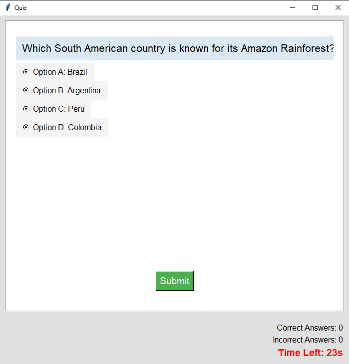

# Quiz-Game-python

A fun and interactive quiz game built using Python's Tkinter library, designed to test your knowledge in various categories such as World Knowledge, Entertainment, Sports, and Religions. The game features a countdown timer, multiple-choice questions, and a score tracker.

## Features
- Multiple categories with a variety of questions.
- Timer countdown for each question.
- Keeps track of correct and incorrect answers.
- Responsive user interface built with Tkinter.
- Fun and challenging quiz format.

## Screenshots




## Prerequisites

Before running the quiz game, make sure you have Python installed on your system along with the required libraries.

### Required Libraries:
- `tkinter` (comes pre-installed with Python)
- `Pillow` (for image handling)

## How to Play
1) The game will present multiple-choice questions from different categories (e.g., World Knowledge, Entertainment, etc.).
2) Select an option and click "Submit."
3) You have 30 seconds to answer each question. A countdown timer will be displayed.
4) After you answer, your score will be updated, and you'll move on to the next question.
5) The game ends when all questions have been answered. You'll see your total score.

You can install the required dependencies using pip:

```bash
pip install pillow
```
```bash
pip install tkinter
```

## Disclaimer

I am not a professional Python developer, and this project is created as a fun way to learn and practice Python. While I've made an effort to ensure the code works correctly, there may still be bugs, issues, or areas for improvement. Feel free to open issues or suggest improvements if you encounter any problems!

Please use this code at your own risk. I encourage you to learn from and modify the code, but I cannot guarantee it's error-free or the most efficient solution.

Thank you for your understanding and happy coding! 😊


